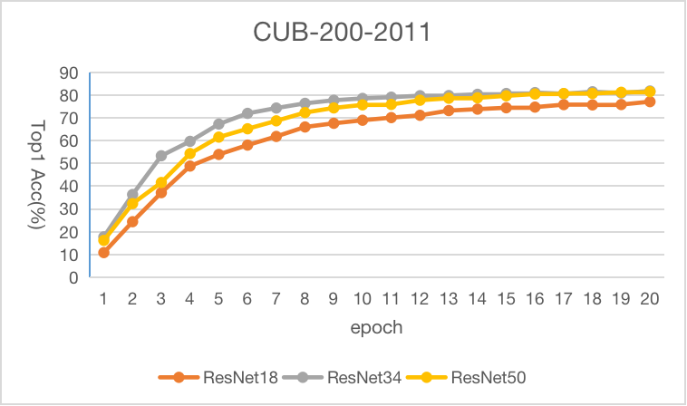

# ResNet_FGIC

Using ResNet for FGIC (fine-grained image classification). PyTorch

**Usage**

> 数据集需要放到 `data`目录

使用默认参数：网络ResNet50，数据集CUB-200-2011 

```shell
python3 main.py
```

## DataSet

| 数据集           | 类别  | 训练集数量 | 测试集数量 |
| ------------- | --- | ----- | ----- |
| CUB-200-2011  | 200 | 5994  | 5794  |
| Stanford Cars | 196 | 8144  | 8041  |
| FGVC Aircraft | 100 | 6667  | 3333  |

## 实验环境

软硬件：

- Tesla T4

- Ubuntu 18.04.6 LTS

- Python 3.8.16

- CUDA Version: 11.2

- PyTorch 1.13.0

参数：

*epochs* - 20

*batch size* - 16

*work nums* - 4

*SDG*优化器 *momentum*=0.9, *weight_decay*=1e-5

初始学习率=0.001,  *StepLR*, *decay step*=2, *gamma*=0.9

图像增强：

```python
transforms.Resize((512, 512)),
transforms.RandomCrop((448, 448)),
transforms.RandomHorizontalFlip(),
transforms.ToTensor(),
transforms.Normalize([0.485, 0.456, 0.406], [0.229, 0.224, 0.225]),
```



## 实验结果

20个epochs取最好的测试结果

| 模型       | CUB-200-2011 | Stanford Cars | FGVC Aircraft |
| -------- | ------------ | ------------- | ------------- |
| ResNet18 | 77.3041%     |               |               |
| ResNet34 | 81.9986%     |               |               |
| ResNet50 | 81.7052%     |               |               |
